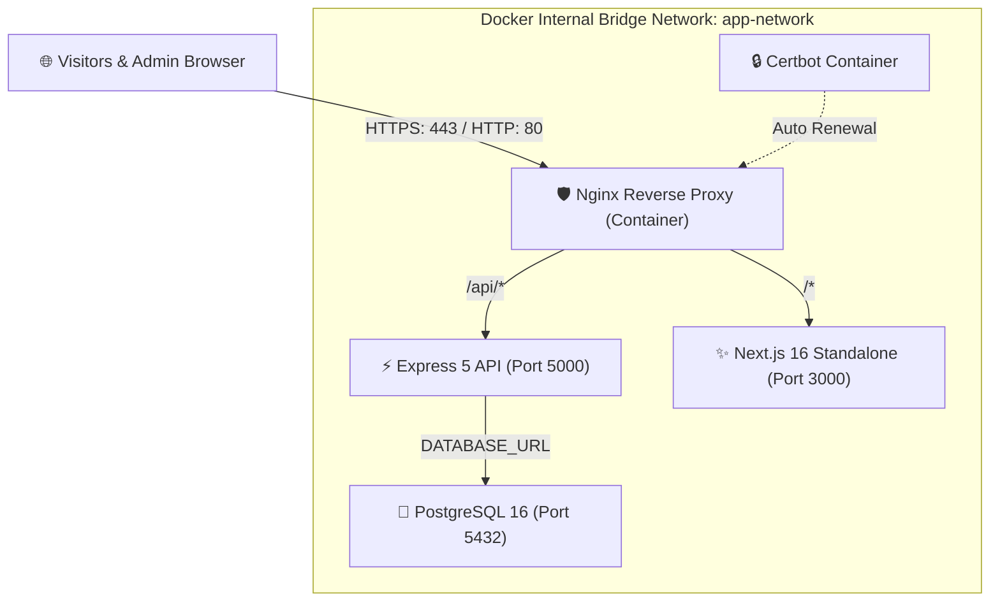

# Complete Production Deployment Guide — Hostinger Ubuntu VPS

This guide provides end-to-end instructions for deploying **SmartHome OS (AT Smart Living)** onto a **Hostinger VPS running Ubuntu (22.04 or 24.04 LTS)** using **Docker Compose**, **PostgreSQL**, **Nginx**, and **Let's Encrypt SSL**.

---

## 🏗 System Architecture



---

## 📋 Prerequisites

- **Hostinger VPS** with **Ubuntu 22.04 LTS** or **Ubuntu 24.04 LTS** (1 vCPU, 2GB+ RAM recommended).
- A domain name (e.g., `atsmartliving.com`) with access to your DNS records.
- SSH access to your VPS (`ssh root@<YOUR_VPS_IP>`).

---

## 🚀 Step 1: Initial Ubuntu Server Setup

Connect to your VPS via SSH terminal:

```bash
ssh root@<YOUR_VPS_IP>
```

### 1.1 Update System Packages
```bash
sudo apt update && sudo apt upgrade -y
```

### 1.2 Configure UFW Firewall
```bash
sudo ufw allow OpenSSH
sudo ufw allow 80/tcp
sudo ufw allow 443/tcp
sudo ufw --force enable
sudo ufw status
```

### 1.3 Install Docker & Docker Compose Plugin
Run the official Docker convenience script:

```bash
curl -fsSL https://get.docker.com -o get-docker.sh
sudo sh get-docker.sh

# Verify Docker installation
docker --version
docker compose version
```

---

## 📦 Step 2: Clone Code & Configure Environment

### 2.1 Clone the Project Repository
```bash
cd /var/www
# If /var/www doesn't exist: sudo mkdir -p /var/www && cd /var/www
git clone <YOUR_GIT_REPOSITORY_URL> smarthome-os
cd smarthome-os
```

### 2.2 Configure Production Environment Variables
Create your production `.env` from the template:

```bash
cp .env.example .env
nano .env
```

Set secure values for your production environment:
```dotenv
# PostgreSQL Database
DB_USER=postgres
DB_PASSWORD=YOUR_STRONG_POSTGRES_PASSWORD_HERE
DB_NAME=smarthome_db

# Security
JWT_SECRET=YOUR_64_CHAR_RANDOM_SECRET_KEY_HERE

# Domain Configuration
DOMAIN_NAME=yourdomain.com
NEXT_PUBLIC_API_URL=/api
CORS_ORIGIN=*

# SMTP (For instant lead notifications to your email)
SMTP_HOST=smtp.gmail.com
SMTP_PORT=587
SMTP_SECURE=false
SMTP_USER=your_email@gmail.com
SMTP_PASS=your_gmail_app_password
ADMIN_EMAIL=inquiries@yourdomain.com
```

Save and exit `nano` (`Ctrl + O`, `Enter`, `Ctrl + X`).

---

## 🌐 Step 3: Configure Domain DNS

In your domain registrar (Hostinger, GoDaddy, Cloudflare, etc.):
1. Add an **A Record**:
   - **Host / Name:** `@`
   - **Value / IP:** `<YOUR_HOSTINGER_VPS_IP>`
2. (Optional) Add a CNAME or A Record for `www`:
   - **Host / Name:** `www`
   - **Value:** `<YOUR_HOSTINGER_VPS_IP>`

Wait 5–10 minutes for DNS propagation. You can test it by running:
```bash
ping yourdomain.com
```

---

## 🚢 Step 4: First Boot (HTTP Mode)

Make `deploy.sh` and the entrypoint executable:
```bash
chmod +x deploy.sh
chmod +x backend/docker-entrypoint.sh
```

Start the containers:
```bash
docker compose up -d --build
```

Check that all containers are healthy:
```bash
docker compose ps
```

You should see:
- `smarthome-postgres` (healthy)
- `smarthome-backend` (healthy)
- `smarthome-frontend` (running)
- `smarthome-nginx` (running)

### 4.1 Seed the Database (Create Default Admin & Initial Content)
To create the initial admin account (`admin@example.com` / `password123`) and initial projects/blogs:

```bash
docker compose exec backend npx prisma db seed
```

> [!TIP]
> After your first login at `/admin/login`, change the default password immediately!

---

## 🔒 Step 5: Setup Free SSL with Let's Encrypt

### 5.1 Request SSL Certificate via Certbot
Run Certbot to obtain your SSL certificate:

```bash
docker compose run --rm certbot certonly --webroot \
  -w /var/www/certbot \
  -d yourdomain.com \
  -d www.yourdomain.com \
  --email your_email@gmail.com \
  --agree-tos \
  --no-eff-email
```

### 5.2 Activate SSL in Nginx
Once the certificate is generated, update your Nginx configuration using the provided SSL template:

```bash
# Replace DOMAIN_NAME placeholder with your real domain
sed "s/DOMAIN_NAME/yourdomain.com/g" nginx/conf.d/default.ssl.conf.template > nginx/conf.d/default.conf

# Reload Nginx with SSL enabled
docker compose exec nginx nginx -s reload
```

Now open **`https://yourdomain.com`** in your browser! You should see the secure green padlock 🔒.

---

## 🔄 Step 6: Ongoing Maintenance & One-Command Updates

Whenever you push new code to your Git repository, simply SSH into your VPS and run:

```bash
cd /var/www/smarthome-os
./deploy.sh
```

The script will automatically:
1. Pull the latest commits
2. Rebuild only changed containers
3. Run any new database migrations
4. Reload the live site with zero downtime
5. Prune dangling Docker images to preserve disk space

---

## 💾 Step 7: Automated Database Backups (Cron Job)

To automatically back up your PostgreSQL database every night at 2:00 AM:

1. Create a backup script:
```bash
sudo mkdir -p /var/backups/smarthome
sudo nano /usr/local/bin/backup-smarthome-db.sh
```

2. Paste this content:
```bash
#!/bin/bash
BACKUP_DIR="/var/backups/smarthome"
TIMESTAMP=$(date +"%Y%m%d_%H%M%S")
FILENAME="$BACKUP_DIR/smarthome_db_$TIMESTAMP.sql.gz"

docker compose -f /var/www/smarthome-os/docker-compose.yml exec -T postgres pg_dump -U postgres smarthome_db | gzip > "$FILENAME"

# Keep only the last 14 days of backups
find $BACKUP_DIR -type f -name "*.sql.gz" -mtime +14 -exec rm {} +
```

3. Make it executable and add to crontab:
```bash
sudo chmod +x /usr/local/bin/backup-smarthome-db.sh
(crontab -l 2>/dev/null; echo "0 2 * * * /usr/local/bin/backup-smarthome-db.sh") | crontab -
```

---

## 🛠 Useful Operations & Troubleshooting

| Action | Command |
|---|---|
| View live logs for all services | `docker compose logs -f` |
| View backend API logs | `docker compose logs -f backend` |
| View Next.js frontend logs | `docker compose logs -f frontend` |
| View Nginx access & error logs | `docker compose logs -f nginx` |
| Restart all services | `docker compose restart` |
| Stop all services | `docker compose down` |
| Database migration status | `docker compose exec backend npx prisma migrate status` |
| Open PostgreSQL interactive shell | `docker compose exec postgres psql -U postgres -d smarthome_db` |
